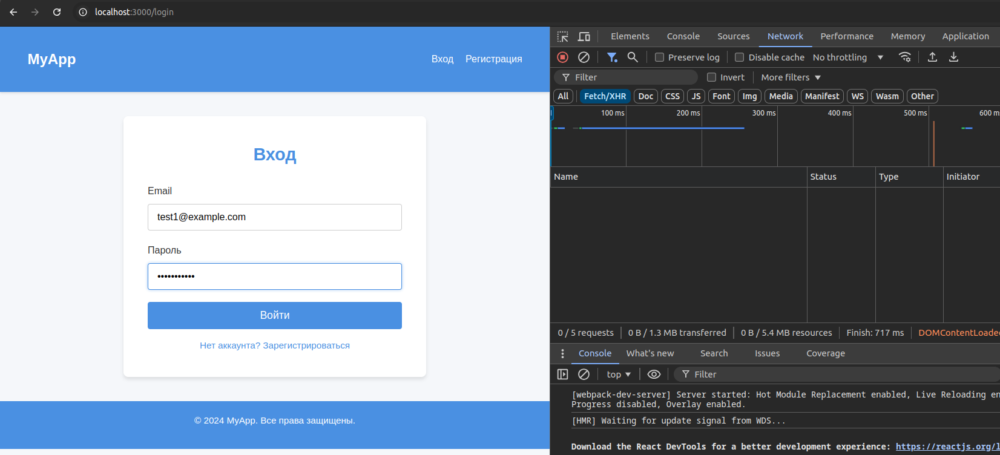
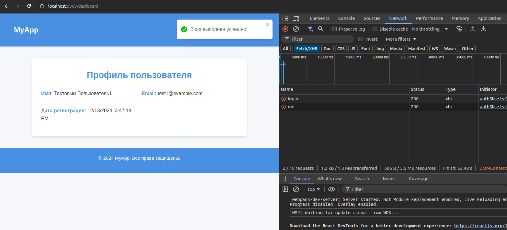
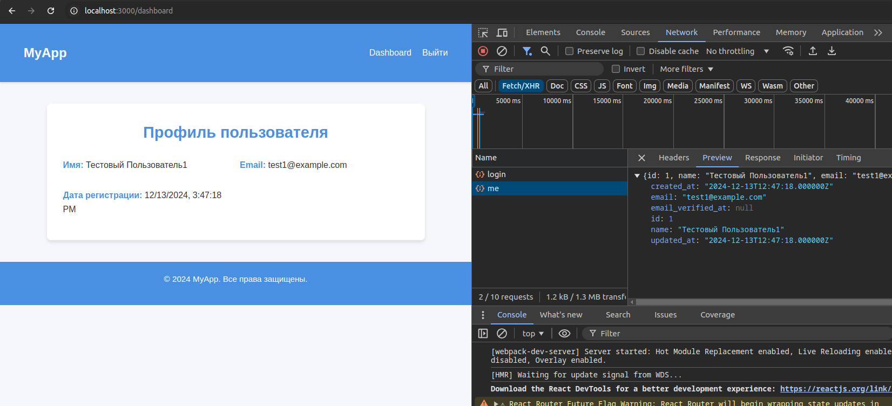

# My React App






## Table of Contents

- [About](#about)
- [Features](#features)
- [Demo](#demo)
- [Installation](#installation)
- [Usage](#usage)
- [Technologies Used](#technologies-used)
- [Contributing](#contributing)
- [License](#license)
- [Contact](#contact)

## About

Welcome to **My React App**! This project is a [brief description of your project]. It aims to [explain the purpose, goals, and what problem it solves]. Whether you're a developer looking to contribute or a user eager to explore, this application offers [highlight key aspects or benefits].

## Features

- **Responsive Design:** Ensures optimal viewing experience across various devices.
- **User Authentication:** Secure login and registration system.
- **Real-time Data Fetching:** Utilizes APIs to display up-to-date information.
- **Interactive UI Components:** Engaging and dynamic user interface elements.
- **State Management:** Efficient handling of application state using [Redux/Context API/etc.].
- **Accessibility:** Compliant with accessibility standards to provide an inclusive experience.

## Installation

Follow these steps to set up the project locally.

### Prerequisites

Ensure you have the following installed:

- [Node.js](https://nodejs.org/en/) (v14 or later)
- [npm](https://www.npmjs.com/) or [Yarn](https://yarnpkg.com/)
- [Git](https://git-scm.com/)

### Steps

1. **Clone the repository:**

    ```bash
    git clone https://github.com/your-username/your-repo-name.git
    cd your-repo-name
    ```

2. **Install dependencies:**

    Using npm:

    ```bash
    npm install
    ```

    Or using Yarn:

    ```bash
    yarn install
    ```

3. **Configure environment variables:**

    Create a `.env` file in the root directory and add the necessary environment variables. You can refer to `.env.example` for guidance.

    ```env
    REACT_APP_API_URL=https://api.yourservice.com
    REACT_APP_API_KEY=your_api_key
    ```

4. **Start the development server:**

    Using npm:

    ```bash
    npm start
    ```

    Or using Yarn:

    ```bash
    yarn start
    ```

    The application will run at [http://localhost:3000](http://localhost:3000).

## Usage

Provide instructions and examples on how to use your application. Include screenshots or GIFs to illustrate features.

### Example

1. **Login:**

    Navigate to the login page and enter your credentials to access the dashboard.

2. **Add a New Item:**

    Click on the "Add Item" button, fill out the form, and submit to add a new item to your list.

    

3. **Edit an Item:**

    Select an item from the list, click "Edit," make your changes, and save.

4. **Delete an Item:**

    Click on the "Delete" button next to an item to remove it from the list.

## Technologies Used

- **Frontend:**
  - [React](https://reactjs.org/) - JavaScript library for building user interfaces.
  - [Redux](https://redux.js.org/) - State management library.
  - [React Router](https://reactrouter.com/) - Routing library for React.
  - [Axios](https://axios-http.com/) - Promise-based HTTP client.

- **Tools:**
  - [Prettier](https://prettier.io/) - Code formatter.
  - [Git](https://git-scm.com/) - Version control system.
  - [GitHub Actions](https://github.com/features/actions) - Continuous Integration and Deployment.

## Contributing

Contributions are welcome! Please follow these steps to contribute to the project.

1. **Fork the repository**

2. **Create a new branch:**

    ```bash
    git checkout -b feature/YourFeatureName
    ```

3. **Make your changes and commit them:**

    ```bash
    git commit -m "Add some feature"
    ```

4. **Push to the branch:**

    ```bash
    git push origin feature/YourFeatureName
    ```

5. **Open a Pull Request**

Please ensure your code adheres to the project's coding standards and passes all linting and tests.

## License

This project is licensed under the [MIT License](LICENSE).

## Contact

- **Your Name** - [@telegram](https://t.me/yodajackson)

